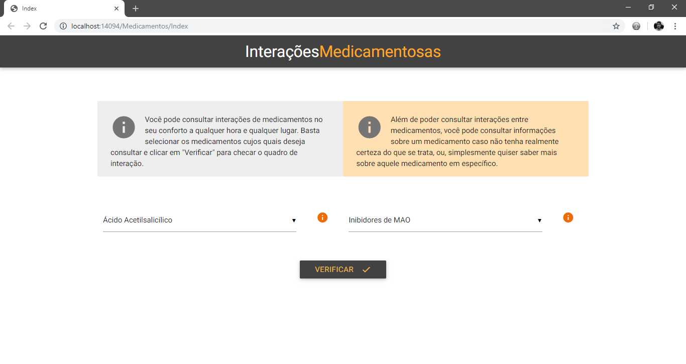
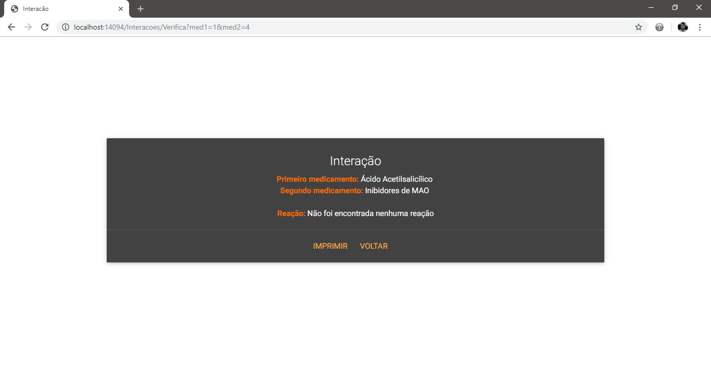
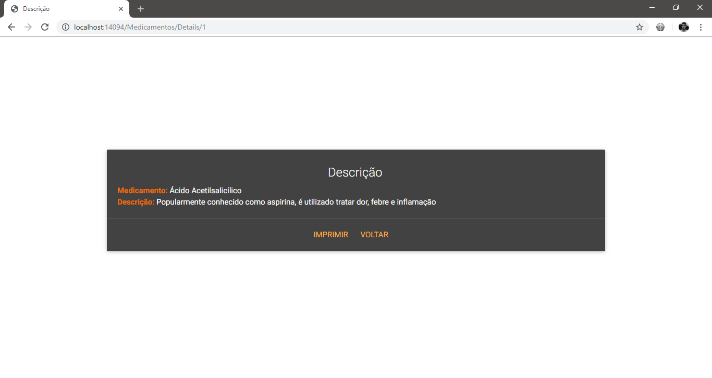

# ASP.NET e arquitetura MVC: Aplicação para consulta de interações medicamentosas 

  Trabalho proposto pelo professor Celso na disciplina de Ferramentas de Desenvolvimento(5º Período) do curso de Ciência da Computação, onde o objetivo fora desenvolver uma aplicação para consultar interações entre medicamentos e informar efeitos colaterais.
  
  Para tal, foram utilizadas a plataforma ASP.NET 4.5.2 e arquitetura MVC 5.2.3.0. Para gerenciar e manipular os dados, foi utilizado o Entity Framework 4.0.0.0, que, por meio da aborgagem *Database First* faz o mapeamento do banco de dados SQL Server 13.0.4224.16 para o modelo, criando automaticamente todas as classes referentes aos *Models* da nossa aplicação. 
   
  No front-end foi utilizado o framework Materialize 0.97.6.
  
  
#### ATENÇÃO: OS DADOS UTILIZADOS NESTE PROJETO SÃO ORIUNDOS DE PESQUISAS EM SITES DE INTERNET, JÁ QUE FORAM UTILIZADOS COM O ÚNICO PROPÓSITO DE APRENDIZAGEM. PORTANTO, NÃO GARANTIMOS A VERACIDADE DOS MESMOS!
  
##### Outros desenvolvedores: Willian Pereira Mariano

#### Capturas de tela:

